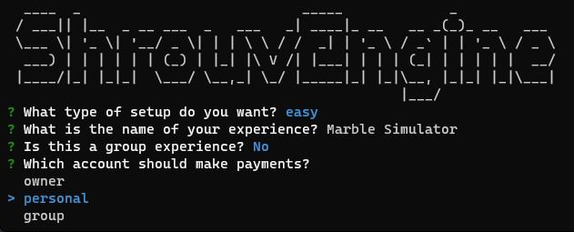
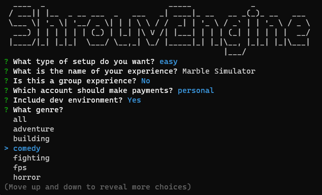
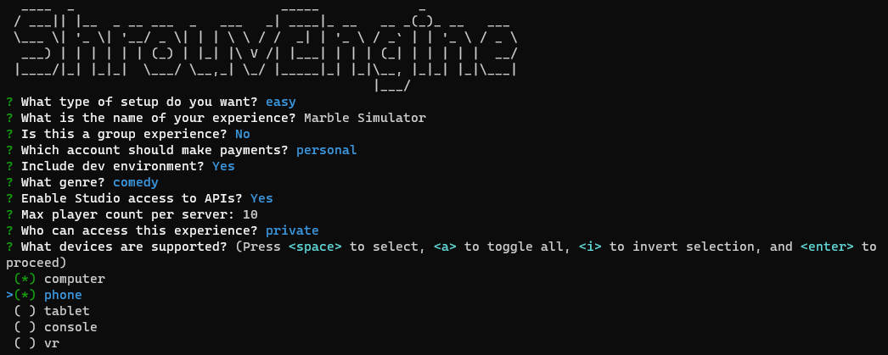
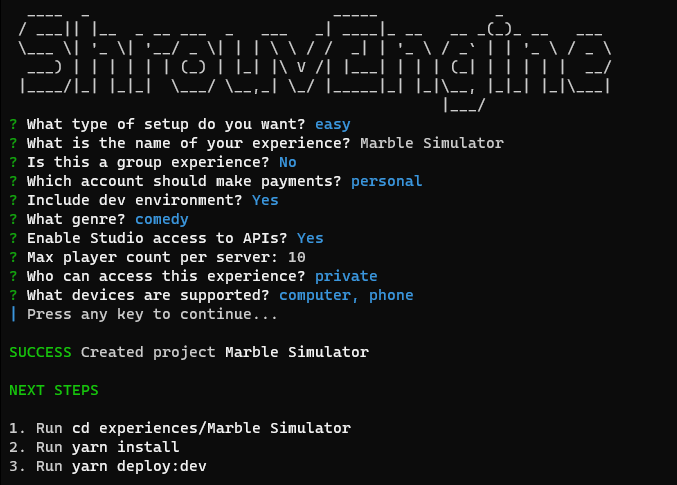
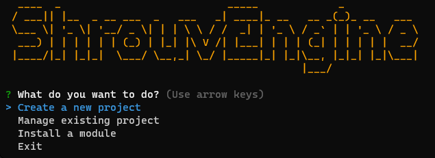
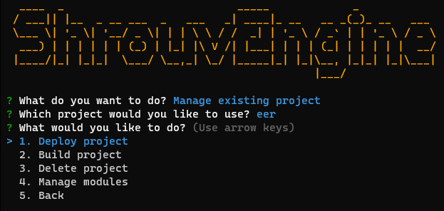
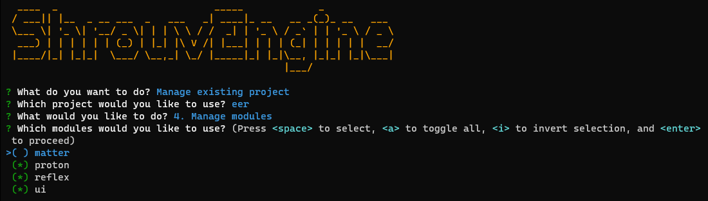

<br/>
<p align="center">
  <a href="https://github.com/mandrillxx/shrouvrblx">
    
  </a>

  <h3 align="center">ShrouvRBLX - Engine </h3>

  <p align="center">
    Main Repository containing all ShrouvEngine packages, including the CLI, Engine & Documentation.
    <br/>
    <br/>
    <a href="https://github.com/mandrillxx/shrouvrblx/wiki"><strong>Explore the docs »</strong></a>
    <br/>
    <br/>
    <a href="https://github.com/mandrillxx/shrouvrblx">View Demo</a>
    .
    <a href="https://github.com/mandrillxx/shrouvrblx/issues">Report Bug</a>
    .
    <a href="https://github.com/mandrillxx/shrouvrblx/issues">Request Feature</a>
  </p>
</p>

     

## Table Of Contents

* [Built With](#built-with)
* [Screenshots](#screenshots)
* [Getting Started](#getting-started)
  * [Prerequisites](#prerequisites)
* [Usage](#usage)
* [Roadmap](#roadmap)
* [Contributing](#contributing)
* [License](#license)
* [Authors](#authors)
* [Acknowledgements](#acknowledgements)

## Built With

- [Mantle](https://github.com/blake-mealey/mantle)
- [Tarmac](https://github.com/Roblox/tarmac/releases)
- [Roblox-TS](https://roblox-ts.com/)
- [Flipbook](https://github.com/flipbook-labs/flipbook)
- [ReactLua](https://github.com/jsdotlua/react-lua)
- [Docusaurus](https://github.com/facebook/docusaurus)

## Screenshots
 
 
 


## Getting Started

```bash
cd shrouvrblx
npm run install
npm run new
```
Then visit [the wiki](https://github.com/mandrillxx/shrouvrblx/wiki) to continue setting up your shrouv experience. The documentation provides all usage details.

### Prerequisites

This is an example of how to list things you need to use the software and how to install them.

* npm
* yarn
* [foreman](https://github.com/Roblox/foreman)

```sh
npm install npm@latest -g
```

## Usage

Start by generating a new experience using the [ShrouvCLI](https://github.com/mandrillxx/shrouvcli)

Generate a new ShrouvEngine game using the configurable **classic template**.

The classic template will automatically be added to your project after you run the following commands:

```bash title="Project Root Directory"
git clone --recursive https://github.com/mandrillxx/shrouvrblx.git
cd shrouvrblx
npm run install
npm run new
```

_For more examples, please refer to the [Documentation](https://github.com/mandrillxx/shrouvrblx/wiki)_

## Roadmap

See the [open issues](https://github.com/mandrillxx/shrouvrblx/issues) for a list of proposed features (and known issues).

## Contributing

Contributions are what make the open source community such an amazing place to be learn, inspire, and create. Any contributions you make are **greatly appreciated**.
* If you have suggestions for adding or removing projects, feel free to [open an issue](https://github.com/mandrillxx/shrouvrblx/issues/new) to discuss it, or directly create a pull request after you edit the *README.md* file with necessary changes.
* Please make sure you check your spelling and grammar.
* Create individual PR for each suggestion.
* Please also read through the [Code Of Conduct](https://github.com/mandrillxx/shrouvrblx/blob/main/CODE_OF_CONDUCT.md) before posting your first idea as well.

### Creating A Pull Request

1. Fork the Project
2. Create your Feature Branch (`git checkout -b feature/AmazingFeature`)
3. Commit your Changes (`git commit -m 'Add some AmazingFeature'`)
4. Push to the Branch (`git push origin feature/AmazingFeature`)
5. Open a Pull Request

## License

Distributed under the MIT License. See [LICENSE](https://github.com/mandrillxx/shrouvrblx/blob/main/LICENSE.md) for more information.

## Authors

* **mandrillxx** - *Comp Sci Student* - [mandrillxx](https://github.com/mandrillxx/) - *Built ShrouvEngine*

## Acknowledgements

* [ImgShields](https://shields.io/)
